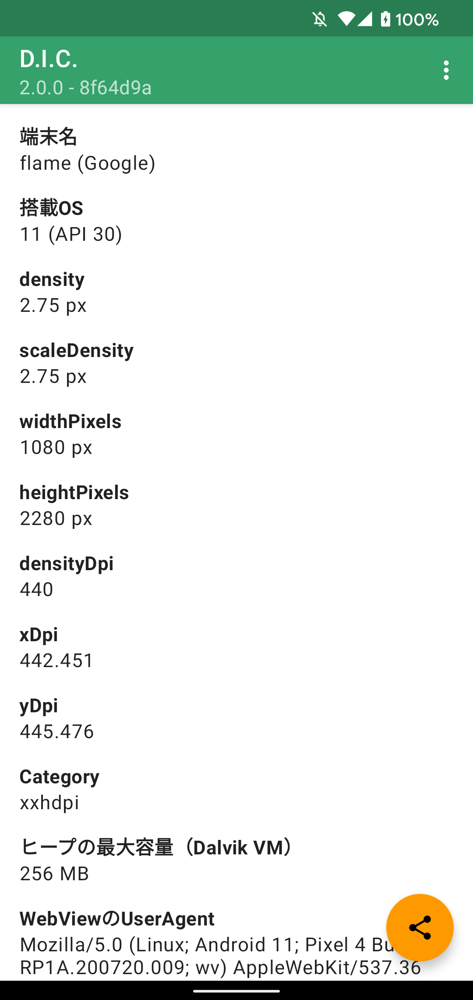
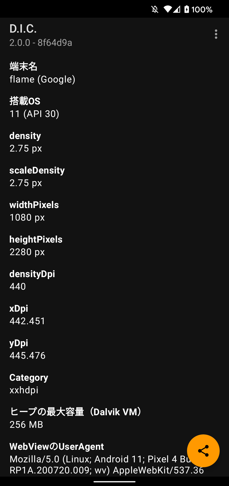
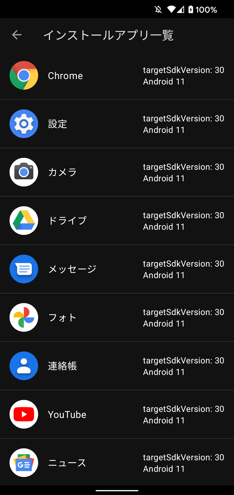

D.I.C. (Device Information Check)
=================================

D.I.C.は、インストールした端末の情報などを見たりするためのアプリです。
共有機能で取得した情報をメモ帳に保存したり、メールで送信することもできます。
ついでに端末にインストールしているアプリのtargetSdkVersionを確認する機能もあります。

今後も何かいろいろ機能が増えたり減ったりします。

## Development Environment

- Android Studio 4.1 以上（Stableの最新版）
- [A successful Git branching modelで提案されたブランチモデル](https://nvie.com/posts/a-successful-git-branching-model/)で開発を行っています

## Architecture

Android Jetpackを利用し、公式が推奨するアーキテクチャで開発を行っています。

[Guide to app architecture  |  Android Developers](https://developer.android.com/jetpack/guide)

## Memo

本プロジェクトは、@yamacraftの技術開発や検証を目的に改修等を行っています。
そのため、第三者からのPull Requestは受け付けておりません。
issueでのご意見等は歓迎します。

また、実際の開発はprivateリポジトリで行っています。
公開版のリポジトリはmasterブランチのみをpushしています。
